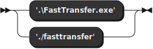
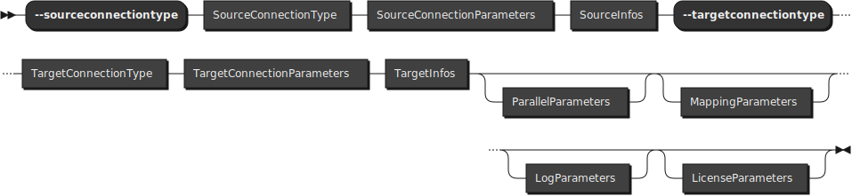
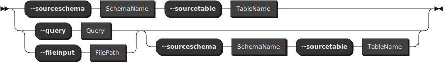
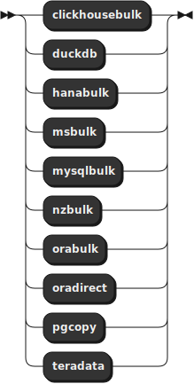
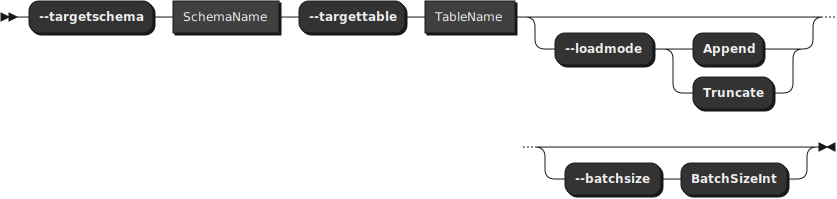

# FastTransfer CLI

FastTransfer is a command-line interface tool designed for efficient data transfer between various database systems. It offers a wide range of options to customize the data transfer process to suit different requirements and environments.


## Supported Sources

Source | Windows AMD64 | Linux AMD64 | Linux ARM64
:--- | :---: | :---: | :---:
ClickHouse | ✅ | ✅ | ✅
DuckDB | ✅ | ✅ | ✅
MySQL | ✅ | ✅ | ✅
Netezza | ✅ | ✅ | ✅
ODBC | ✅ | ✅  | ✅
OLEDB | ✅ |❌  | ❌
Oracle | ✅ | ✅ | ✅
PostgreSQL | ✅ | ✅ | ✅
SQL Server | ✅ | ✅ | ✅
SAP Hana | ✅ | ✅ | ❌
Teradata | ✅ | ✅ | ❌

## Supported Targets

Target | Windows AMD64 | Linux AMD64 | Linux ARM64
:--- | :---: | :---: | :---:
ClickHouse | ✅ | ✅ | ✅
DuckDB | ✅ | ✅ | ✅
MySQL | ✅ | ✅ | ✅
Netezza | ✅ | ✅ | ✅
ODBC | ❌ | ❌  | ❌
OLEDB | ❌ |❌  | ❌
Oracle | ✅ | ✅ | ✅
PostgreSQL | ✅ | ✅ | ✅
SQL Server | ✅ | ✅ | ✅
SAP Hana | ✅ | ✅ | 
Teradata | ✅ | ✅ | 

## Limitations and connections

- array data types are not always supported in the current version (except for pgcopy target)
- spatial data types are not always supported between heterogenous rdbms.

## Gui Wizard to generate command line
[FastTransfer Wizard](FastTransfer_Wizard.html)

## Syntax:


**FastTransferCommand:**




**FastTransferOptions:**




**SourceConnectionType:**


**SourceConnectionParameters:**


**SourceInfos:**




**SourceConnectionType:**




**TargetConnectionParameters:**


**TargetInfos:**




**AdvancedParameters:**


**LogParameters:**


### Options explained

- `-?`, `--help`  
  Show help information.

- `-c`, `--sourceconnectiontype <type>` 

    Source Connection Type. 
    Allowed Values: 

    * `clickhouse` for ClickHouse
    * `duckdb` for duckdb
    * `duckdbstream` for duckdb using streaming (more memory efficient))
    * `hana` for SAP HANA (.net driver)
    * `msoledbsql` SQL Server OleDB
    * `mssql` SQL Server Native Client (.Net)
    * `mysql` MySQL
    * `nzcopy` Netezza copy (WIP)
    * `nzoledb` Netzza OleDB
    * `nzsql` Netezza Native (.net driver)
    * `odbc` ODBC datasource (DSN must be configured)
    * `oledb` Generic OleDB datasource
    * `oraodp` Oracle ODP.Net
    * `pgcopy` PostgreSQL Copy
    * `pgsql` PostgreSQL Native (.Net)
    * `teradata` Teradata (.Net)


 - `-g`, `--sourceconnectstring <connectionstring>`  
    Source Connection String. (override all other source connection parameters).

  - `-n`, `--sourcedsn <dsn>`  
    ODBC DSN. (only if odbc source type is used). Drivers must be already installed on the machine and DSN must be configured.

  - `-p`, `--sourceprovider <provider>`  
    OleDB provider (e.g., `MSOLEDBSQL` for MSSQL or `NZOLEDB` for Netezza...).
    Only if oledb source type is used. OleDB provider must be already installed on the machine.

  - `-i`, `--sourceserver <server>`  
    * Source SQL instance (Server or Server\instance or Server:port)
    * for DuckDB the .duckdb file or :memory: 

  - `-u`, `--sourceuser <user>`  
    Source user.

  - `-x`, `--sourcepassword <password>`  
    Source user's password.

  - `-a`, `--sourcetrusted`  
    Switch to use trusted authentication on source.

  - `-d`, `--sourcedatabase <database>`  
    Source database.

  - `-s`, `--sourceschema <schema>`  
    Source schema. (must be set if pgsql Ctid method is used)

  - `-t`, `--sourcetable <table>`  
    Source table. (must be set if pgsql Ctid method is used)

  - `-q`, `--query <query>`  
    Plain text SQL query. Will be used instead of source table if provided

  - `-f`, `--fileinput <file>`  
    Input file storing SQL query. The file must exist.

  - `-C`, `--targetconnectiontype <type>`  
    Target Connection Type. 
    Allowed Values: 

    * `clickhousebulk` for ClickHouse BulkCopy
    * `duckdb` for DuckDB
    * `hanabulk` for SAP HANA 
    * `msbulk` for SQL Server BulkCopy
    * `mysqlbulk` for MySQL BulkCopy
    * `nzbulk` for Netezza BulkCopy
    * `orabulk` for Oracle BulkCopy
    * `oradirect` for Oracle Direct
    * `pgcopy` for postgresql using copy (Binary format for postgresql sources and Text for others)
    * `pgsql` for PostgreSQL Native (.Net)
    * `teradata` for Teradata (.Net)


  - `-I`, `--targetserver <server>`  
    * Target SQL instance :
    Server or Server\instance or Server:port.
    * .duckdb file for DuckDB


  - `-U`, `--targetuser <user>`  
    Target user.

  - `-X`, `--targetpassword <password>`  
    Target user's password.

  - `-A`, `--targettrusted`  
    Switch to use trusted authentication on target.

  - `-D`, `--targetdatabase <database>`  
    Target database.

  - `-S`, `--targetschema <schema>`  
    Target schema.

  - `-T`, `--targettable <table>`  
    Target table.


  - `-M`, `--method <method>`  
    Method for parallelism (if needed).
    Allowed Values: 

    - `DataDriven` Use the distinct value of the distributeKeyColumn (which can be an expression) to distribute data
    - `Ctid` Recommanded for postgreSQL. use the Ctid pseudo column (for pgsql and pgcopy source only)
    - `Random` Use a modulo on the distributeKeyColumn to distribute data
    - `Rowid` For Oracle sources only : use rowid slices
    - `RangeId` Use a numeric range to distribute data (useful with an identity column or sequence without gaps. The column must be numerical)
    - `Ntile` Use the ntile function to distribute data evenly data can be numerical, date, datetime or string
    - `NZDataSlice` : Netezza only. Use the data slices to distribute data retrieval
    - `None` No parallelism
    
    Default Value: `None`. If you want to use a parallel export/import use other than None. Try to use Parallelism only if you have a large amount of data to transfer (more than 1M cells).

  - `-K`, `--distributeKeyColumn <column>`  
    Column to be used to distribute data Not needed if Ctid method is used.

  - `-P`, `--degree <degree>`  
    Degree of Parallelism
    
    * `0` for Auto 
    * `0 > n < 1024` for fixed degree.
    * `n < 0` negative values will be used to adapt the degree of parallelism to the number of available CPUs.
    eg : -2 will use half the cpus on the machine where FastTransfer is launched 
    
    Default Value: `1`.
  
  - `Q`, `--datadrivenquery`  
    Override query to be used to get the values for the DataDriven method. You can avoid select distinct of the distributeKeyColumn on large table, if you have de reference table that contains all the values.

  - `-L`, `--loadmode <mode>`  
    Load mode. 
    Allowed Values: 
    - `Append` append data to the target table
    - `Truncate` truncate the target table before loading
    
    Default Value: `Append`.

  - `-B`, `--batchsize <size>`  
    Batch Size for BulkCopy. Default Value: `1048576`.

  - `-W`, `--useworktables`  
    Swith that will activate the usage of intermediate work tables. Useful in some rare cases

  - `-R`, `--runid <RunSpanID>`  
    Run ID. coming from the caller. It will be used to allow tracing of the process. Default is a random Guid.  

  - `O` ,`--settingsfile`
    Custom Settings file for logging and other settings. Default is `FastTransfer__settings.json` in the same folder as the executable.


## Examples

```powershell
.\FastTransfer.exe `
--sourceconnectiontype "mssql" `
--sourceserver "localhost" `
--sourceuser "fastuser" `
--sourcepassword "fastpassword" `
--sourcedatabase "AdventureWorks2017" `
--sourceschema "Person" `
--sourcetable "Person" `
--targetconnectiontype "pgcopy" `
--targetserver "localhost" `
--targetuser "fastuser" `
--targetpassword "fastpassword" `
--targetdatabase "fastdb" `
--targetschema "public" `
--targettable "Person" `
--method "RangeId" ` 
--distributeKeyColumn "PersonID" `
--loadmode "Truncate" `
--degree -2 `  #Automatically adapt the degree of parallelism to 1/2 of cpu available
--runid "mssql-to-pgcopy-123456"
```

```powershell
.\FastTransfer.exe `
--sourceconnectiontype "pgsql" `
--sourceserver "localhost:15432" `
--sourceuser "fastuser" `
--sourcepassword "fastpassword" `
--sourcedatabase "fastdb" `
--sourceschema "Public" `
--sourcetable "Person" `
--targetconnectiontype "msbulk" `
--targetserver "localhost" `
--targetuser "fastuser" `
--targetpassword "fastpassword" `
--targetdatabase "AdventureWorks2017" `
--targetschema "Person" `
--targettable "Person" `
--method "Ctid" ` # Ctid is for pgsql and pgcopy source only 
--loadmode "Truncate" `
--degree -2 `  #Automatically adapt the degree of parallelism to 1/2 of cpu available
--runid "pgsql-to-msbulk-123456"
```


for more examples see [examples](./samples/samples.md)


## Installation

Download the latest version from the link provided by Arpe.io and extract the files to a folder on your machine.
That's it! You are ready to use FastTransfer.

## Configuration and settings for logging

FastTransfer uses a settings file to configure the logging.
The default file is `FastTransfer_settings.json` in the same folder as the executable. You can specify a custom file using the `-O` option.

You can start from the default file and modify it to suit your needs.

- You can, for exemple, change the connection string for the logs database, or the minimum level of logging.
- You can also remove some targets if you don't need them in the using section.

```json
{
  "ConnectionStrings": {
    "MS_FastTransferLogs": "Server=localhost;Database=FastTransferLogs;Integrated Security=SSPI;Encrypt=True;TrustServerCertificate=True"
  },
  "Serilog": {
    "Using": [
      "Serilog.Sinks.Console",
      "Serilog.Sinks.File",
      "Serilog.Sinks.MSSqlServer",
      "Serilog.Enrichers.Environment",
      "Serilog.Enrichers.Thread",
      "Serilog.Enrichers.Process",
      "Serilog.Enrichers.Context"
    ],
    "MinimumLevel": "Debug",
```


## License

Commercial License. Contact us at [sales@arpe.io](mailto:sales@arpe.io) for more information.

[CLUF](legal/CONTRAT%20%DE%20%LICENCE%20%UTILISATEUR%20%FINAL.pdf)


